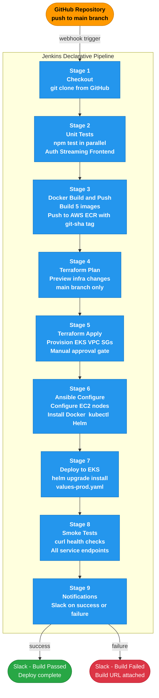
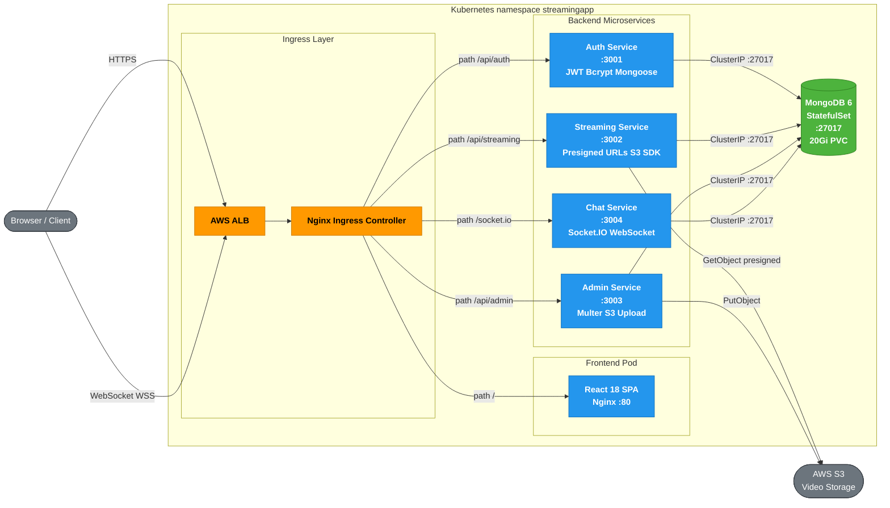
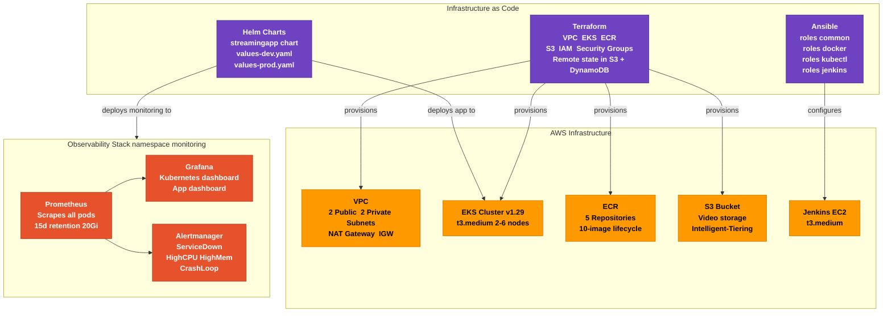

# StreamingApp

> Stream premium video content, host live watch parties, and manage your catalogue with a modern microservices architecture. The platform ships with a production-ready admin portal, real-time chat, S3-backed streaming, and a cinematic React frontend — deployed on AWS EKS via a fully automated Jenkins CI/CD pipeline.

---

## Table of Contents

- [Microservices Overview](#microservices-overview)
- [Architecture Diagrams](#architecture-diagrams)
  - [System Architecture](#system-architecture)
  - [CI/CD Pipeline](#cicd-pipeline)
  - [Microservices & Network Flow](#microservices--network-flow)
  - [Infrastructure Overview](#infrastructure-overview)
- [Tech Stack](#tech-stack)
- [Environment Configuration](#environment-configuration)
- [Running Locally with Docker Compose](#running-locally-with-docker-compose)
- [Local Development](#local-development)
- [Kubernetes Deployment (AWS EKS)](#kubernetes-deployment-aws-eks)
- [Helm Chart](#helm-chart)
- [Terraform — AWS Infrastructure](#terraform--aws-infrastructure)
- [Ansible — Configuration Management](#ansible--configuration-management)
- [Jenkins CI/CD Pipeline](#jenkins-cicd-pipeline)
- [Monitoring — Prometheus & Grafana](#monitoring--prometheus--grafana)
- [Feature Highlights](#feature-highlights)
- [Repository Structure](#repository-structure)
- [License](#license)

---

## Microservices Overview

| Service | Port | Technology | Responsibility |
|---|---|---|---|
| `frontend` | 80 (Nginx) | React 18 + MUI | SPA served via Nginx reverse-proxy |
| `authService` | 3001 | Node.js/Express + Mongoose | User registration, login, JWT, password reset |
| `streamingService` | 3002 | Node.js/Express + AWS S3 | Video catalogue, presigned URLs, playback |
| `adminService` | 3003 | Node.js/Express + Multer + S3 | Video upload/management by admin roles |
| `chatService` | 3004 | Node.js/Express + Socket.IO | Real-time WebSocket chat during streams |
| `mongo` | 27017 | MongoDB 6 | Shared database (one DB per service namespace) |

All backend services share common database models via `backend/common`. Each service is independently deployable, scalable, and communicates via REST APIs and WebSockets.

---

## Architecture Diagrams

### 1. System Architecture (AWS Production)

```mermaid
graph TB
    User([User / Browser])

    subgraph AWS[AWS Cloud  us-east-1]
        subgraph VPC[VPC  10.0.0.0/16]

            subgraph PUBLIC[Public Subnets  AZ-a and AZ-b]
                ALB[Application Load Balancer\nHTTPS 443 / HTTP 80]
                JENKINS[Jenkins EC2\nt3.medium  Ubuntu 22.04]
            end

            subgraph PRIVATE[Private Subnets  EKS Worker Nodes]
                subgraph EKS[AWS EKS Cluster  v1.29]
                    INGRESS[Nginx Ingress Controller]

                    subgraph APP[namespace  streamingapp]
                        FE[Frontend\nReact 18 + Nginx  :80]
                        AUTH[Auth Service\nNode.js  :3001]
                        STREAM[Streaming Service\nNode.js  :3002]
                        ADMIN[Admin Service\nNode.js  :3003]
                        CHAT[Chat Service\nSocket.IO  :3004]
                        MONGO[(MongoDB 6\nStatefulSet  :27017\n20Gi PVC)]
                    end

                    subgraph MON[namespace  monitoring]
                        PROM[Prometheus\n15d retention]
                        GRAF[Grafana\nDashboards]
                        ALERTMGR[Alertmanager]
                    end
                end
            end
        end

        ECR[AWS ECR\n5 Docker Repositories]
        S3[AWS S3\nstreamingapp-videos]
        SECRETS[AWS Secrets Manager\nJWT  DB creds  AWS keys]
        TFSTATE[S3 + DynamoDB\nTerraform Remote State]
    end

    SLACK([Slack\n#devops-alerts])

    User -->|HTTPS| ALB
    User -->|WebSocket WSS| ALB
    ALB --> INGRESS
    INGRESS -->|/| FE
    INGRESS -->|/api/auth| AUTH
    INGRESS -->|/api/streaming| STREAM
    INGRESS -->|/api/admin| ADMIN
    INGRESS -->|/socket.io| CHAT

    AUTH --> MONGO
    STREAM --> MONGO
    ADMIN --> MONGO
    CHAT --> MONGO

    STREAM -->|presigned URL| S3
    ADMIN -->|PutObject| S3

    AUTH --> SECRETS
    STREAM --> SECRETS
    ADMIN --> SECRETS
    CHAT --> SECRETS

    PROM -->|scrape /metrics| AUTH
    PROM -->|scrape /metrics| STREAM
    PROM -->|scrape /metrics| ADMIN
    PROM -->|scrape /metrics| CHAT
    PROM --> ALERTMGR
    ALERTMGR -->|alert| SLACK
    GRAF -->|query| PROM

    JENKINS -->|docker push| ECR
    JENKINS -->|helm upgrade| EKS
    JENKINS -->|terraform apply| VPC
    JENKINS --> TFSTATE
    ECR -->|imagePull| APP

    classDef aws fill:#FF9900,stroke:#FF6600,color:#000,font-weight:bold
    classDef eks fill:#326CE5,stroke:#1a4fa0,color:#fff,font-weight:bold
    classDef service fill:#2496ED,stroke:#0d6ebd,color:#fff
    classDef db fill:#4DB33D,stroke:#2e7d1f,color:#fff,font-weight:bold
    classDef mon fill:#E6522C,stroke:#b33d1e,color:#fff
    classDef external fill:#6c757d,stroke:#495057,color:#fff
    classDef user fill:#17a2b8,stroke:#117a8b,color:#fff,font-weight:bold

    class ALB,ECR,S3,SECRETS,TFSTATE aws
    class EKS,INGRESS eks
    class FE,AUTH,STREAM,ADMIN,CHAT service
    class MONGO db
    class PROM,GRAF,ALERTMGR mon
    class JENKINS,SLACK external
    class User user
```



---

### 2. CI/CD Pipeline



---

### 3. Microservices Network Flow



---

### 4. Infrastructure & Observability Overview



---

## Tech Stack

| Layer | Technology |
|---|---|
| **Frontend** | React 18, MUI, Nginx 1.27 |
| **Backend** | Node.js 18, Express, Mongoose, Socket.IO, Multer |
| **Database** | MongoDB 6 (StatefulSet on EKS) |
| **Container Registry** | AWS ECR (5 repositories) |
| **Orchestration** | AWS EKS (Kubernetes 1.29) |
| **Ingress** | AWS ALB + Nginx Ingress Controller |
| **CI/CD** | Jenkins (EC2 t3.medium) |
| **Infrastructure as Code** | Terraform >= 1.6 (AWS provider ~> 5.0) |
| **Configuration Management** | Ansible + AWS EC2 dynamic inventory |
| **Packaging** | Helm 3 |
| **Object Storage** | AWS S3 + CloudFront CDN (optional) |
| **Secrets** | AWS Secrets Manager |
| **Monitoring** | Prometheus + Grafana + Alertmanager (kube-prometheus-stack) |
| **Notifications** | Slack (#devops-alerts) |

---

## Environment Configuration

Create a `.env` file for each service before running locally. All backend services accept standard AWS credentials for S3 access.

### Auth Service — `backend/authService/.env`

```ini
PORT=3001
MONGO_URI=mongodb://localhost:27017/streamingapp
JWT_SECRET=changeme
CLIENT_URLS=http://localhost:3000
AWS_ACCESS_KEY_ID=
AWS_SECRET_ACCESS_KEY=
AWS_REGION=us-east-1
AWS_S3_BUCKET=
```

### Streaming Service — `backend/streamingService/.env`

```ini
PORT=3002
MONGO_URI=mongodb://localhost:27017/streamingapp
JWT_SECRET=changeme
CLIENT_URLS=http://localhost:3000
AWS_ACCESS_KEY_ID=
AWS_SECRET_ACCESS_KEY=
AWS_REGION=us-east-1
AWS_S3_BUCKET=
AWS_CDN_URL=
STREAMING_PUBLIC_URL=http://localhost:3002
```

### Admin Service — `backend/adminService/.env`

```ini
PORT=3003
MONGO_URI=mongodb://localhost:27017/streamingapp
JWT_SECRET=changeme
CLIENT_URLS=http://localhost:3000
AWS_ACCESS_KEY_ID=
AWS_SECRET_ACCESS_KEY=
AWS_REGION=us-east-1
AWS_S3_BUCKET=
```

### Chat Service — `backend/chatService/.env`

```ini
PORT=3004
MONGO_URI=mongodb://localhost:27017/streamingapp
JWT_SECRET=changeme
CLIENT_URLS=http://localhost:3000
```

### Frontend — `frontend/.env`

```ini
REACT_APP_AUTH_API_URL=http://localhost:3001/api
REACT_APP_STREAMING_API_URL=http://localhost:3002/api
REACT_APP_STREAMING_PUBLIC_URL=http://localhost:3002
REACT_APP_ADMIN_API_URL=http://localhost:3003/api/admin
REACT_APP_CHAT_API_URL=http://localhost:3004/api/chat
REACT_APP_CHAT_SOCKET_URL=http://localhost:3004
```

---

## Running Locally with Docker Compose

```bash
# 1. Copy and populate env files for each service (see above)

# 2. Build and start the full stack
docker-compose up --build

# 3. Open the app
open http://localhost:3000
```

The compose file provisions MongoDB plus all four Node.js microservices. S3 credentials are optional for local testing — you can browse seeded metadata, but streaming requires valid S3 objects.

---

## Local Development

Install dependencies for each service and run them in separate terminals after starting MongoDB:

```bash
# Auth Service
cd backend/authService && npm install && npm run dev

# Streaming Service
cd backend/streamingService && npm install && npm run dev

# Admin Service
cd backend/adminService && npm install && npm run dev

# Chat Service
cd backend/chatService && npm install && npm run dev

# Frontend
cd frontend && npm install && npm start
```

---

## Kubernetes Deployment (AWS EKS)

All Kubernetes manifests are in the `k8s/` directory.

```bash
# 1. Configure kubectl
aws eks update-kubeconfig --name streamingapp-cluster --region us-east-1

# 2. Create namespace
kubectl apply -f k8s/namespace.yaml

# 3. Create secrets (replace placeholder values first)
kubectl apply -f k8s/secrets.yaml

# 4. Deploy MongoDB StatefulSet
kubectl apply -f k8s/mongo-statefulset.yaml

# 5. Deploy all microservices
kubectl apply -f k8s/auth-service.yaml
kubectl apply -f k8s/streaming-service.yaml
kubectl apply -f k8s/admin-service.yaml
kubectl apply -f k8s/chat-service.yaml
kubectl apply -f k8s/frontend.yaml

# 6. Apply Ingress (requires ALB Ingress Controller installed)
kubectl apply -f k8s/ingress.yaml
```

### HPA Scaling Targets

| Service | Min Replicas | Max Replicas | CPU Trigger |
|---|---|---|---|
| `auth-service` | 2 | 6 | 70% |
| `streaming-service` | 2 | 8 | 60% |
| `chat-service` | 2 | 6 | 70% |

---

## Helm Chart

A single parameterised Helm chart (`helm/streamingapp/`) manages all five services. Switch between environments by overriding the values file:

```bash
# Deploy to production
helm upgrade --install streamingapp ./helm/streamingapp \
  --namespace streamingapp --create-namespace \
  -f helm/values-prod.yaml \
  --set global.imageTag=<GIT_SHA> \
  --wait --timeout 5m

# Deploy to dev
helm upgrade --install streamingapp ./helm/streamingapp \
  --namespace streamingapp-dev --create-namespace \
  -f helm/values-dev.yaml
```

Production overrides (`helm/values-prod.yaml`) increase replica counts: Auth ×3, Streaming ×4 (maxReplicas 12), Chat ×3.

---

## Terraform — AWS Infrastructure

All AWS resources are managed as code in the `terraform/` directory. Remote state is stored in S3 with DynamoDB locking.

```bash
cd terraform

# Initialise with remote backend
terraform init \
  -backend-config="bucket=streamingapp-tfstate" \
  -backend-config="key=eks/terraform.tfstate" \
  -backend-config="region=us-east-1"

# Preview changes
terraform plan

# Apply
terraform apply
```

### Resources Provisioned

| File | Resources |
|---|---|
| `vpc.tf` | VPC, 2 public + 2 private subnets, IGW, NAT Gateway |
| `eks.tf` | EKS 1.29 cluster, managed node group (t3.medium, 2–6 nodes) |
| `ecr.tf` | 5 ECR repositories with 10-image lifecycle policy |
| `s3.tf` | S3 bucket with versioning + encryption |
| `iam.tf` | IAM roles for EKS node group and pod S3 access |
| `security.tf` | Security groups for Jenkins EC2 and EKS nodes |

---

## Ansible — Configuration Management

Ansible playbooks configure the Jenkins EC2 instance and EKS worker nodes. AWS EC2 dynamic inventory discovers hosts automatically via tags.

```bash
cd ansible

# Configure all hosts
ansible-playbook -i inventory/aws_ec2.yml site.yml --extra-vars "env=prod"
```

### Roles

| Role | Installs |
|---|---|
| `common` | OS updates, NTP, hostname, swap disable |
| `docker` | Docker CE 25+, adds jenkins user to docker group |
| `kubectl` | kubectl 1.29, Helm 3, AWS CLI v2, Terraform 1.7 |
| `jenkins` | Java 17, Jenkins LTS, systemd unit, initial admin |

---

## Jenkins CI/CD Pipeline

The `Jenkinsfile` at the repository root defines a 9-stage declarative pipeline triggered by a GitHub webhook on push to `main`.

| Stage | Action |
|---|---|
| **1 — Checkout** | Clone repository from GitHub |
| **2 — Unit Tests** | `npm test` for Auth, Streaming, and Frontend in parallel |
| **3 — Docker Build & Push** | Build all 5 images, tag with `git-sha`, push to AWS ECR |
| **4 — Terraform Plan** | Preview infrastructure changes (main branch only) |
| **5 — Terraform Apply** | Apply EKS/VPC/SG changes — requires manual approval gate |
| **6 — Ansible Configure** | Run playbooks to configure EC2/nodes |
| **7 — Deploy to EKS** | `helm upgrade --install` with production values |
| **8 — Smoke Tests** | `curl` health checks against all live service endpoints |
| **9 — Notifications** | Slack alert on success or failure |

### Jenkins Credentials Required

| Credential ID | Type | Used For |
|---|---|---|
| `aws-account-id` | Secret text | ECR registry URL |
| `aws-credentials` | AWS credentials | ECR login, EKS, Terraform |
| `github-ssh-key` | SSH key | Repository checkout |

---

## Monitoring — Prometheus & Grafana

Both are deployed into the `monitoring` namespace via the `kube-prometheus-stack` Helm chart.

```bash
# Add repos
helm repo add prometheus-community https://prometheus-community.github.io/helm-charts
helm repo add grafana https://grafana.github.io/helm-charts
helm repo update

# Install Prometheus stack (includes Alertmanager, kube-state-metrics, node-exporter)
helm upgrade --install kube-prometheus-stack prometheus-community/kube-prometheus-stack \
  --namespace monitoring --create-namespace \
  -f helm/monitoring/prometheus-values.yaml
```

### Alert Rules

| Alert | Condition | Severity |
|---|---|---|
| `ServiceDown` | Pod unreachable for 1 min | Critical |
| `HighCPUUsage` | CPU > 80% for 5 min | Warning |
| `HighMemoryUsage` | Memory > 85% of limit for 5 min | Warning |
| `PodCrashLooping` | Restart rate > 0 for 2 min | Critical |

Alerts route to Slack via Alertmanager → `#devops-alerts`.

---

## Feature Highlights

- **S3-backed streaming** with secure presigned uploads for admins and presigned playback URLs for users.
- **Dedicated admin microservice** for video ingestion, metadata management, and featured curation.
- **Real-time chat** overlay in the player using Socket.IO with persistent message history.
- **Modern React experience** featuring cinematic hero sections, dynamic carousels, and responsive design.
- **Role-aware access control** across frontend routes and all backend microservices.
- **Horizontal Pod Autoscaling** on Auth, Streaming, and Chat services based on CPU utilisation.
- **Zero-downtime deployments** via RollingUpdate strategy (`maxUnavailable: 0`).
- **Full observability** with Prometheus metrics, Grafana dashboards, and Slack alerting.

---

## Repository Structure

```
StreamingApp/
├── Jenkinsfile                  # 9-stage CI/CD pipeline
├── docker-compose.yml           # Local development stack
├── frontend/                    # React 18 + Nginx SPA
├── backend/
│   ├── authService/             # JWT auth — :3001
│   ├── streamingService/        # Video catalogue — :3002
│   ├── adminService/            # Admin uploads — :3003
│   └── chatService/             # Socket.IO chat — :3004
├── k8s/                         # Kubernetes YAML manifests
│   ├── namespace.yaml
│   ├── secrets.yaml
│   ├── mongo-statefulset.yaml
│   ├── auth-service.yaml
│   ├── streaming-service.yaml
│   ├── admin-service.yaml
│   ├── chat-service.yaml
│   ├── frontend.yaml
│   └── ingress.yaml
├── helm/
│   ├── streamingapp/            # Main Helm chart
│   │   ├── Chart.yaml
│   │   ├── values.yaml
│   │   └── templates/
│   ├── values-prod.yaml         # Production overrides
│   └── monitoring/              # Prometheus + Grafana values
├── terraform/                   # AWS infrastructure as code
│   ├── main.tf
│   ├── variables.tf
│   ├── vpc.tf
│   ├── eks.tf
│   ├── ecr.tf
│   ├── s3.tf
│   ├── iam.tf
│   └── security.tf
├── ansible/                     # Configuration management
│   ├── site.yml
│   ├── ansible.cfg
│   ├── inventory/
│   │   └── aws_ec2.yml
│   └── roles/
│       ├── common/
│       ├── docker/
│       ├── kubectl/
│       └── jenkins/
└── docs/                        # Architecture diagrams, runbooks
```

---

## License

MIT © Apoorva Deshpande
